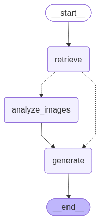

# nim-multimodal-agent

[](https://github.com/Karthikvenugopal/nim-multimodal-agent/actions/workflows/ci.yml)

A **multimodal agentic RAG pipeline** built on [NVIDIA NIM](https://build.nvidia.com)
with a benchmark-style evaluation layer. A LangGraph agent retrieves over a mixed
text + image corpus, routes retrieved figures through a NIM vision-language model
to extract the facts they contain, and generates grounded answers with a Nemotron
text model — scored by an LLM-as-judge benchmark for correctness and faithfulness,
plus a vision **ablation** that quantifies how much the multimodal path actually
contributes.

<p align="center">
  
</p>

- **Genuinely multimodal**: the figure data in `corpus/images/` (latency
  benchmarks, revenue mix, GPU utilization, pipeline diagram, error rates)
  exists *only in the pixels* — figure and cross-modal questions cannot be
  answered from the text, so they exercise the real vision path
  (base64 image → NIM VLM).
- **Genuinely agentic**: a compiled LangGraph `StateGraph` with a conditional
  edge that routes to vision analysis only when a retrieved image passes a
  relevance gate (top-ranked, or above an absolute similarity threshold), so
  the vision model fires on figure/cross-modal questions and is skipped on
  pure-text ones.
- **Cross-modal reasoning**: three benchmark questions (`CM*`) require *fusing*
  a fact read from a figure with a fact retrieved from text — e.g. "which
  variant has the lowest p95 latency (figure), and how many camera streams does
  it support (text)?" Neither modality answers them alone.
- **Honest evaluation**: a 14-question labeled set (text-answerable, figure-only,
  cross-modal, and one unanswerable question that tests abstention), scored for
  answer correctness and context-faithfulness by a Nemotron judge — with a
  vision ablation that reruns the set blind to measure the multimodal lift.

## Pipeline

```
retrieve ──(relevant image queued?)──> analyze_images ──> generate
    └──────────(text only)──────────────────────────────────^
```

1. **Ingest** — text docs are split into passage chunks; image captions index
   the figures. All chunks are embedded with a NIM retrieval model.
2. **Retrieve** — top-k chunks by cosine similarity. A retrieved image is queued
   for vision only if it is rank-1 or scores above a similarity threshold.
3. **Analyze images** — each queued figure is sent (base64) to the NIM
   vision-language model, which extracts the labels/values it shows.
4. **Generate** — the Nemotron text model answers *only* from the text passages
   plus the vision findings, abstaining when the context is insufficient.

## Models (NVIDIA NIM, OpenAI-compatible API)

| Role | Default model | Env var |
|---|---|---|
| Vision-language | `nvidia/nemotron-nano-12b-v2-vl` | `NIM_VISION_MODEL` |
| Generation + judge | `nvidia/llama-3.3-nemotron-super-49b-v1.5` | `NIM_TEXT_MODEL` |
| Retrieval embeddings | `nvidia/llama-nemotron-embed-1b-v2` | `NIM_EMBED_MODEL` |

All calls go through `https://integrate.api.nvidia.com/v1` via the `openai`
SDK, with retry/backoff on transient errors. The NIM catalog changes often —
override any model with the env vars above (see `.env.example`).

## Setup

```bash
python3 -m venv .venv && source .venv/bin/activate
pip install -r requirements.txt
cp .env.example .env   # paste your nvapi- key from https://build.nvidia.com
```

## Usage

```bash
# single question (multimodal: retrieves the figure, fires the vision model)
python main.py "What is the p95 inference latency of the VoltEdge Max on ResNet-50?"

# full labeled benchmark with LLM-as-judge scoring
python main.py --benchmark

# text-only baseline (vision path disabled)
python main.py --benchmark --no-vision

# ablation: run the benchmark with and without vision, report the lift
python main.py --ablation
```

## Repo layout

```
corpus/docs/            3 markdown docs (text facts)
corpus/images/          5 chart/diagram PNGs (figure-only facts)
corpus/manifest.json    image captions used for retrieval (values withheld)
corpus/questions.json   14 labeled questions (text / figure / cross_modal / unanswerable)
nim_client.py           NIM chat / vision / embedding client (+ retry/backoff)
agent.py                LangGraph graph: retrieve → route → vision → generate
evaluate.py             benchmark harness, LLM-as-judge, vision ablation
main.py                 CLI
scripts/make_images.py  regenerates the corpus figures (matplotlib)
scripts/render_graph.py renders docs/graph.png from the compiled graph
tests/test_offline.py   offline unit tests (no API key needed); run via pytest
docs/graph.png          rendered LangGraph diagram
```

## Benchmark results

Real output of `python main.py --benchmark` against the live NIM API:

```
models: vision=nvidia/nemotron-nano-12b-v2-vl  text=nvidia/llama-3.3-nemotron-super-49b-v1.5  embed=nvidia/llama-nemotron-embed-1b-v2
ingesting corpus...
ingested 16 chunks (11 text, 5 image)

  [T1] PASS  vision=n  faith=1.00  (3.5s)
  [T2] PASS  vision=n  faith=1.00  (5.7s)
  [T3] PASS  vision=n  faith=1.00  (28.7s)
  [T4] PASS  vision=n  faith=1.00  (4.3s)
  [T5] PASS  vision=n  faith=1.00  (7.4s)
  [F1] PASS  vision=Y  faith=1.00  (14.2s)
  [F2] PASS  vision=Y  faith=1.00  (25.3s)
  [F3] PASS  vision=Y  faith=1.00  (27.1s)
  [F4] PASS  vision=Y  faith=1.00  (8.3s)
  [F5] PASS  vision=Y  faith=1.00  (24.6s)
  [U1] PASS  vision=n  faith=1.00  (2.2s)
  [CM1] PASS  vision=Y  faith=1.00  (14.2s)
  [CM2] PASS  vision=Y  faith=1.00  (21.5s)
  [CM3] PASS  vision=Y  faith=1.00  (15.2s)

id    type          vision  correct  faithful    sec
----------------------------------------------------
T1    text          no      1        1.00        3.5
T2    text          no      1        1.00        5.7
T3    text          no      1        1.00       28.7
T4    text          no      1        1.00        4.3
T5    text          no      1        1.00        7.4
F1    figure        yes     1        1.00       14.2
F2    figure        yes     1        1.00       25.3
F3    figure        yes     1        1.00       27.1
F4    figure        yes     1        1.00        8.3
F5    figure        yes     1        1.00       24.6
U1    unanswerable  no      1        1.00        2.2
CM1   cross_modal   yes     1        1.00       14.2
CM2   cross_modal   yes     1        1.00       21.5
CM3   cross_modal   yes     1        1.00       15.2
----------------------------------------------------

type            n  accuracy  vision-fire
cross_modal     3   100.0%      100.0%
figure          5   100.0%      100.0%
text            5   100.0%        0.0%
unanswerable    1   100.0%        0.0%

questions:                     14
answer accuracy:               100.0%
mean faithfulness:             1.00
vision-dependent accuracy:     100.0%  (figure + cross_modal)
vision fired when needed:      100.0%
```

Metric notes: **correct** is judged against the gold label (for the
unanswerable question U1, "correct" means the agent abstained);
**faithfulness** is the judged fraction of answer claims supported by the
retrieved context and vision findings; **vision** marks runs where the agent
routed retrieved figures through the vision model.

## Vision ablation

To show the multimodal path is doing real work — not that the text model is
guessing figure values — `python main.py --ablation` reruns the whole set with
the vision route disabled. Figure and cross-modal questions then lose the only
source of their answer. Real output against the live NIM API:

```
=== ablation: answer accuracy, vision ON vs OFF ===
type            n  vision-on  vision-off    delta
-------------------------------------------------
cross_modal     3    100.0%      66.7%   +33.3
figure          5    100.0%      40.0%   +60.0
text            5    100.0%     100.0%    +0.0
unanswerable    1    100.0%     100.0%    +0.0
-------------------------------------------------
overall        14    100.0%      71.4%   +28.6
```

Disabling vision leaves text and unanswerable questions untouched (+0.0) but
collapses figure-only accuracy (100% → 40%) and cross-modal accuracy
(100% → 66.7%), for a **+28.6-point overall lift** from the multimodal path.
The figure drop is not a clean 100% → 0%: two figure questions (a "largest
revenue share" and a firmware-comparison) remain answerable blind because the
text model produces a plausible answer the judge accepts — a useful reminder
that an LLM judge can over-credit guessable questions, and exactly the kind of
signal an ablation is meant to expose.

## Tests

Offline unit tests (corpus loading, judge-JSON parsing, graph routing and the
relevance gate, the `--no-vision` path, retry/backoff, response cleaning) run
without an API key and execute in CI on every push:

```bash
pip install -r requirements-dev.txt
pytest -q
```
